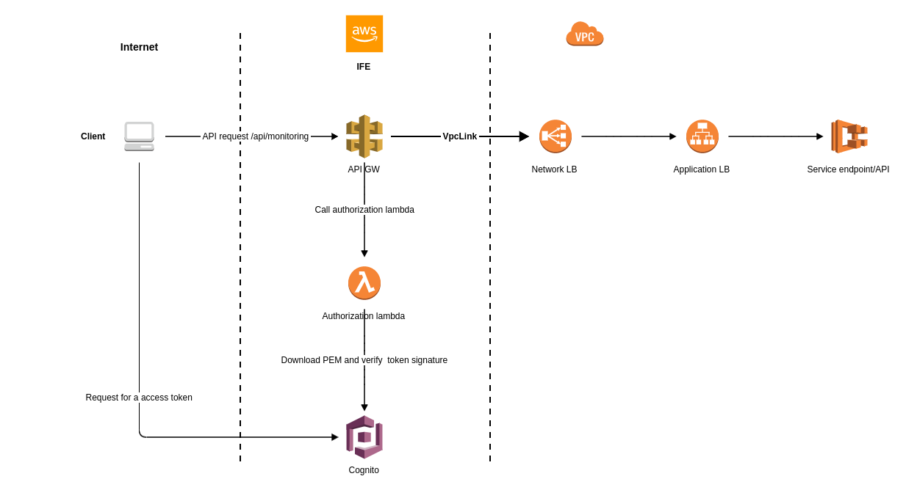

# Terraform module template to create an Internet Facing Environment - IFE

[](https://github.com/telia-oss/terraform-module-template/actions)

This module allows to expose private/internal endpoints of services without need to have VPC public subnet.
 Its designed just for REST at this moment. It supports OAuth 2.0 for machine to machine communication.

Currently this module supports only integration with Network Load Balancer via VPC link

## Basic diagram
IFE terraform module creates resources described in section **IFE**


- Cognito 
    - OAuth **client_credentials** OAuth flow
    - list of clients
        - each client identified by client_id:secret
        - each client has list of OAuth scopes which determine which API is client authorized to call
        
- Creates API Gateway 
    - VPC link
    - resources/methods/vpclink_lintegrations
    - stage for deployment
    - custom domain name (Optional)
    
 - Custom authorization lambda (API GW custom authorizer) to validate access tokens and authorize clients OAuth scopes

 
## Usage
At the beginning we need json configuration which consists of two pars:
 1) api path configuration for exposing internal resources
 2) client configuration
 
Configuration JSON example:
```JSON
{
  "mappings": [
    {
      "scope_path": "api-path-to-expose-1",
      "resource_server": "IFE-RS-1",
      "target": "https://some-service.example.com/endpoint-1",
      "enabled": true
    }
  ],
  "clients": [
    {
      "name": "ife-client-1",
      "allowed_oauth_flows": [
        "client_credentials"
      ],
      "allowed_scopes": [
        "IFE-RS-1/api-apt-to-expose-1",
        "IFE-RS-1/api-apt-to-expose-2"
      ]
    }
  ]
}
```
**JSON structure explained:**
It its composed from 2 parts:
1) mappings
    * `scope_path` API GW endpoint exposed to public
    * `resource_server` name of resource server holding OAuth allowed scopes 
    * `target` is internal service endpoint where client's request should be proxied to
    * `enabled` says if api is in use or not
    
2) clients
    * `name` client's name which will be used when new client is created
    * `allowed_oauth_flows` currently only client_credentials supported
    * `allowed_scopes` what API on API GW level is client authorized to call. 
     It is combination of `resource_server/scope_path` values
    
Then we need to configure infrastructure with TF module
```HCL
module "ife" {
  source = "../modules/ife"
  
  #GLOBAL configuration
  ife_configuration = jsondecode(file("./files/ife-configuration-example.json"))

  region      = "eu-west-1"
  environment = "dev"
  name        = "IFE"
  project     = "MY-PROJECT"

  #COGNITO configuration
  pool_name          = "IFE-dev"
  cognito_sub_domain = "my-cognito"

  #API GATEWAY configuration
  api_version = 1.0
  root_path   = "api"
  nlb_arn     = "arn:aws:elasticloadbalancing:eu-west-1:..."

  create_api_custom_domain = true
  certificate_domain       = "example.my-domain.com"
  api_sub_domain           = "my-api-gw"
}
```

<br/>

> API deployment has to be made in 2 steps (2 applies).
> 1) leave `api_version` unchanged and update API GW resources
> 2) update `api_version` which will trigger API Gateway deployment


# IFE module technical details
Provider requirements:
* **aws:** (any version) 
 
# Sub modules
## ife-api-gateway
### Input variables

`ife_configuration`
IFE JSON configuration

`root_path` 
Beginning path after API Gateway URL

`cognito_user_pool_arn`
Cognito user pool ARN for lambda authorizer"

`authorization_lambda_arn`
API GW custom authorizer lambda ARN

`authorization_lambda_invoke_arn`
API GW custom authorizer lambda invoke ARN

`nlb_arn`
Network ELB arn for VPC link

`stage_name`
Stage name or environment for API deployment

`api_version`
When changed API GW deployes API

`api_gw_log_retetion`
API gateway cloud watch logs retention in days

`create_custom_domain`
Boolean if custome domain name should be created. Currently only AWS ACM supported"

`certificate_domain`
Domain to be used with API Gateway"

`custom_sub_domain`
Sub-domain to be used with API Gateway

`tags`
A map of tags to add to all resources"


### Output Variables


## ife-cognito
### Input variables
`ife_configuration`
IFE JSON configuration

`cognito_pool_name`
IFE cognito pool name

`custom_sub_domain`
Sub-domain to be used with Cognito. Domain prefix is mandatory

`tags`
A map of tags to add to all resources

### Output Variables
`cognito_pool_id`
IFE cognito pool ID

`cognito_pool_arn`
IFE cognito pool ARN

## ife-lambda
### Input variables
`lambda_log_retention`
Lambda cloud watch log retention in days

`env_region`
Environment variable for lamda

`env_user_pool_id`
Environment variable for lamda

`tags`
A map of tags to add to all resources

### Output Variables
`authorization_lambda_arn`
IFE custom authorization lambda ARN

`authorization_lambda_invoke_arn`
IFE custom authorization lambda invoke ARN

## Authors

Currently maintained by [these contributors](../../graphs/contributors).

## License

MIT License. See [LICENSE](LICENSE) for full details.
